# 🧠 Jarvis - Autonomous Local AI Agent

A multimodal, privacy-first AI agent designed to run locally on Windows. It perceives its environment through computer vision, listens via voice input, and executes system-level actions autonomously using **Function Calling**.

## 🚀 Key Features

* **🤖 Local LLM Orchestration:** Powered by **Llama 3** (via Ollama) & **LangChain**.
* **🛠️ Agentic Capabilities:** The AI autonomously decides when to trigger tools (Lock PC, Open Apps, Search Web) based on intent.
* **⚡ Low-Latency Architecture:** Uses Python `threading` and `queues` to decouple Model Inference, TTS, and Video Streaming for real-time performance.
* **👁️ Computer Vision:** Live streaming of Webcam & Desktop via **OpenCV** & **MSS** to a mobile-responsive dashboard.
* **🔐 Secure Remote Access:** Production-ready exposure via **Nginx Reverse Proxy** and **Cloudflare Tunnels**.
* **📊 Monitoring:** Real-time CPU/RAM visualization.

## 📱 Dashboard


## 🛠️ Tech Stack

* **Core:** Python 3.x, Flask (Async)
* **AI:** Ollama, LangChain
* **Vision:** OpenCV, MSS
* **Automation:** PyAutoGUI, AppOpener
* **Infrastructure:** Nginx, Cloudflare Zero Trust

## ⚙️ Installation

### Prerequisites
* Python 3.10+
* [Ollama](https://ollama.com/) with `llama3` model pulled.
* Nginx & Cloudflare (optional for remote access).

### Setup
1. Clone the repository:
   ```bash
   git clone https://github.com/Alexrai123/jarvis-remote-dashboard.git
   cd jarvis-remote-dashboard
   ```
2. Install dependencies:
   ```bash
   pip install -r requirements.txt
   ```

## 🎮 Usage

**Manual Startup Steps:**

1.  **Ollama**: Ensure the Ollama app is running in the background.
2.  **Nginx**: Navigate to the Nginx installation folder and double-click `nginx.exe`. *(Note: It must be run from the folder, not via Windows Search)*.
3.  **Cloudflare Tunnel**: Open a terminal in the project folder and run:
    ```bash
    cloudflared tunnel --url http://127.0.0.1:80
    ```
4.  **Jarvis**: Open a second terminal and run:
    ```bash
    python jarvis.py
    ```

## 🧠 System Architecture

```mermaid
graph TD
    User[📱 Mobile User] -->|HTTPS| CF[Cloudflare Tunnel]
    CF -->|Reverse Proxy| Nginx[Nginx Server]
    Nginx -->|Request| Flask[Flask Backend]
    
    subgraph "Jarvis Core (Local PC)"
        Flask -->|Video Feed| CV[OpenCV/MSS]
        Flask -->|Text Prompt| LLM[Ollama / Llama3]
        LLM -->|Decision| Tools[Tool Execution]
        Tools -->|Action| Sys[Windows System / Apps]
        Tools -->|Reply| TTS["Voice Engine (Threaded)"]
    end
```



## ⚠️ Security
Allows full remote control. Use only behind secure tunnels (Cloudflare) or VPNs.
